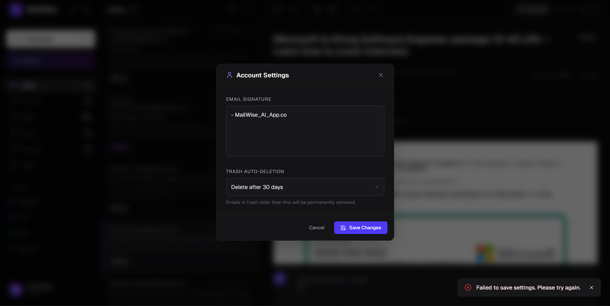

# AI Email SaaS

A modular AI-powered email productivity platform built as a full-stack JavaScript application.

This repository contains a React/Next.js frontend, an Express-based API backend, and two Node.js microservices for email processing and embedding generation. The data stack is powered by PostgreSQL, RabbitMQ, Weaviate, and Ollama for embedding/vectorization.

## Table of Contents

- [Project Overview](#project-overview)
- [Architecture](#architecture)
- [Tech Stack](#tech-stack)
- [Directory Layout](#directory-layout)
- [Requirements](#requirements)
- [Environment Variables](#environment-variables)
- [Setup](#setup)
- [Run Commands](#run-commands)
- [Development Workflow](#development-workflow)
- [Service Details](#service-details)
- [Troubleshooting](#troubleshooting)
- [Notes](#notes)

## Project Overview

This project is an AI email SaaS prototype that:

- Provides a Next.js user interface for email management
- Uses a Node.js/Express API service for authentication, email ingestion, AI summaries, and email actions
- Processes and stores incoming emails in PostgreSQL
- Queues email processing and embedding workloads through RabbitMQ
- Generates embeddings in Weaviate using Ollama vectorization
- Supports Google OAuth, email send/receive workflows, and AI-powered email summaries

## Architecture

The system is split into four main application layers:

1. `frontend/`
   - Next.js 16 React application serving the UI on `http://localhost:3000`
2. `services/api-service/`
   - Express API server exposing authentication, email, AI, send, calendar, ingestion and contact endpoints on `http://localhost:3001`
3. `services/processing-service/`
   - RabbitMQ consumer that stores incoming email payloads in PostgreSQL and forwards content to the embedding queue
4. `services/embedding-service/`
   - RabbitMQ consumer that splits email content and inserts documents into Weaviate to create embeddings via Ollama

Infrastructure services are defined in `docker-compose.yml`:

- PostgreSQL (`postgres:15-alpine`)
- RabbitMQ (`rabbitmq:3.8-management-alpine`)
- Weaviate (`cr.weaviate.io/semitechnologies/weaviate:latest`)
- Ollama (`ollama/ollama`)

## Tech Stack

- Frontend: Next.js 16, React 19, Tailwind CSS, Axios
- Backend: Node.js, Express 5, PostgreSQL, pg, weaviate-client
- Microservices: RabbitMQ queue consumers, LangChain text splitter, Weaviate embeddings
- AI: Google GenAI (`@google/genai`), Ollama vectorization through Weaviate

## Directory Layout

- `/frontend` — Next.js application
- `/services/api-service` — main HTTP API and worker startup
- `/services/processing-service` — email ingestion + queue forwarding service
- `/services/embedding-service` — email embedding generator service
- `/docker-compose.yml` — infrastructure orchestration
- `/.env` — project environment variables

## Requirements

- Node.js 18+ (recommended)
- npm
- Docker and Docker Compose
- Git

## Environment Variables

The project uses a root `.env` file. The following variables are currently configured in `.env`:

- `POSTGRES_USERNAME`
- `POSTGRES_PWD`
- `POSTGRES_DATABASE`
- `GEMINI_API_KEY`
- `JWT_SECRET`
- `GOOGLE_REFRESH_TOKEN`
- `GOOGLE_CLIENT_ID`
- `GOOGLE_CLIENT_SECRET`
- `GOOGLE_REDIRECT_URI`

> Warning: The repository currently contains real-looking values in `.env`. Replace these values for your own deployment and never commit secrets to source control.

## Setup

1. Clone the repository:

```bash
git clone <repository-url> ai-email-saas
cd ai-email-saas
```

2. Verify the root `.env` file exists and is configured.

3. Start infrastructure services:

```bash
docker compose up -d
```

4. Install dependencies for each package:

```bash
cd frontend && npm install
cd ../services/api-service && npm install
cd ../services/processing-service && npm install
cd ../services/embedding-service && npm install
```

## Run Commands

### Using npm

- Start frontend:

```bash
cd frontend
npm run dev
```

- Start API service:

```bash
cd services/api-service
npm run dev
```

- Start processing microservice:

```bash
cd services/processing-service
npm run dev
```

- Start embedding microservice:

```bash
cd services/embedding-service
npm run dev
```

### Using VS Code Tasks

The workspace includes VS Code tasks for convenience:

- `Start Docker`
- `Start Frontend`
- `Start API Service`
- `Start Processing Service`
- `Start Embedding Service`
- `Start All Node Apps`
- `Start All Services`

## Development Workflow

1. Run Docker infrastructure with `docker compose up -d`.
2. Start the API service and both microservices.
3. Run the frontend.
4. Open the browser at `http://localhost:3000`.
5. Use the UI and inspect logs for the API and queue consumers.

## Service Details

### Frontend

- Folder: `frontend`
- Runs on: `http://localhost:3000`
- Uses `frontend/src/lib/api.js` to call the backend at `http://localhost:3001`
- Scripts:
  - `npm run dev`
  - `npm run build`
  - `npm run start`
  - `npm run lint`

### API Service

- Folder: `services/api-service`
- Runs on: `http://localhost:3001`
- Loads environment from root `../../.env`
- Connects to PostgreSQL and Weaviate
- Mounted route groups:
  - `/auth`
  - `/ingestion`
  - `/ai`
  - `/send`
  - `/calendar`
  - `/emails`
  - `/contacts`
- Uses `@google/genai` for AI operations and `weaviate-client` for vector database access

### Processing Service

- Folder: `services/processing-service`
- Connects to RabbitMQ and PostgreSQL
- Consumes from `email_processing_queue`
- Stores emails in PostgreSQL and forwards payloads to `embedding_required_queue`

### Embedding Service

- Folder: `services/embedding-service`
- Connects to RabbitMQ and Weaviate
- Sets up a Weaviate class named `EmailChunks`
- Uses Ollama via Weaviate to vectorize email text
- Consumes from `embedding_required_queue`

## Infrastructure Services

The repo provides the following Docker services:

- `postgres_db` — PostgreSQL database on `5432`
- `rabbitmq_broker` — RabbitMQ broker on `5672` and management UI on `15672`
- `weaviate_db` — Weaviate on `8080`
- `ollama_service` — Ollama on `11434`

## Screenshots

The `res/` folder contains visual references for the application UI and workflow.

- `res/overall preview.png` — Full app workflow preview
- `res/ai compose.png` — AI-assisted email compose screen
- `res/ai summary.png` — AI-generated summary view
- `res/compose & draft.png` — Compose and draft management
- `res/settings.png` — Settings and configuration screen

Below are the visual assets for quick reference:




## Troubleshooting

- If the frontend cannot reach the backend, confirm `services/api-service` is running and `frontend/src/lib/api.js` points to `http://localhost:3001`.
- If RabbitMQ is not reachable, confirm `docker compose ps` and check port `5672`.
- If Weaviate fails to start, inspect container logs and ensure `ollama` is available before the model endpoint is called.
- If the API fails to connect to PostgreSQL, verify `.env` credentials and `postgres_db` container status.

## Notes

- The project is designed for local development and experimentation.
- The root service configuration assumes `localhost` for PostgreSQL, RabbitMQ, and Weaviate.
- For production deployment, externalize `.env` secrets and update service hostnames accordingly.
- The current app uses Google OAuth/GenAI credentials and may require valid Google API access.

---

### Quick Start

```bash
docker compose up -d
cd frontend && npm install
cd ../services/api-service && npm install
cd ../services/processing-service && npm install
cd ../services/embedding-service && npm install
cd frontend && npm run dev
cd ../services/api-service && npm run dev
cd ../services/processing-service && npm run dev
cd ../services/embedding-service && npm run dev
```

Open `http://localhost:3000` in your browser.
